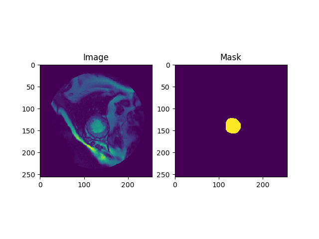
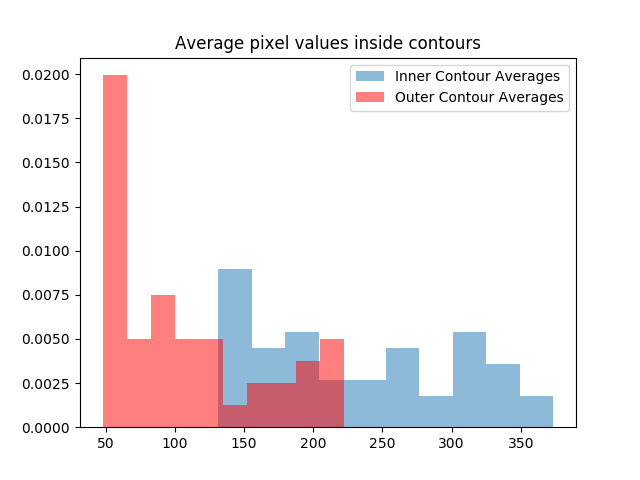
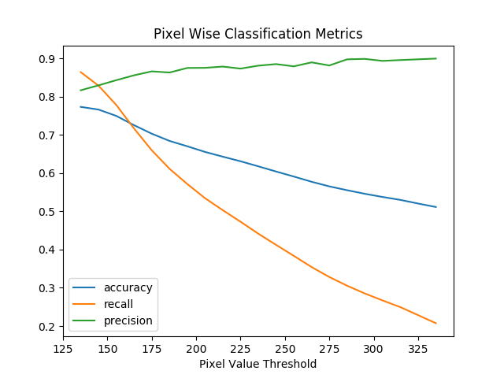

# MRI SEGMENTATION

## Pre-Processing Pipeline

### Part 1-1

I experimented with the existing source code, located in [src/parsing.py](https://github.com/TarynHeilman/mri_segmentation/blob/master/src/parsing.py). I made minimal changes to get the code to run - needed to change all references of `dicom` to `pydicom` as the current version requires. Once these changes were made, the functions ran as written.

To verify that contours were being parsed correctly, I wrote a unittest to check the parsing function using a simple square polygon. See the first test in [test/unittests.py](https://github.com/TarynHeilman/mri_segmentation/blob/master/test/unittests.py) for more details.

I also visually inspected a few examples from the dataset, which looked accurate (to my admittedly limited knowledge on the subject!) See example below.

For ease of pre-processing, I created a pipeline class ([src/pipeline.py](https://github.com/TarynHeilman/mri_segmentation/blob/master/src/pipeline.py)). For the first pass, I created the methods `process_one_mask` and `create_masks`. The first reads in image and contour files for a single datapoint, and writes the corresponding boolean mask to disk as a `.npy` file with the same relative file path under the `data/masks` directory. The latter method loops through all of the available image files, checks that the corresponding contour file exists, and if so, calls the first method.

### Part 1-2
For the next pass, I added methods to the class that allowed for reading in files in small batches for model training. To streamline this process, I slightly modified the methods detailed in part one to include
storing lists of paths to images and the targets masks on the class so that those lists did not need to get re-created at run-time. A very basic unittest was constructed to ensure that those lists were the same length, and referenced the same data points.

I constructed a helper method `read_batch_arrays`, which takes a list of files, reads the two file formats and constructs two numpy arrays for the images and the targets. I implemented a basic unittest for this function to check that the arrays have the same shape, which helps validate earlier steps in the pipeline, but by no means is a comprehensive screen against all bugs or edge cases. The `batch_train` method utilizes scikit-learn's `KFold` class to generate shuffled batches of filenames, which it feeds to the helper method.

The code runs, passes *rudimentary* unit tests, and appears to create the appropriate files, but requires more rigorous testing.

### Part 2-1

Changes made to pipeline:
* Modified `process_one_mask` slightly, so that it returned the numpy array rather than writing to the file internally. This was part of a process to simplify and modularize the main loop function, `create_masks`, which was already long without the implementation of writing o-contour masks. Some slight functional changes were made to the pipeline - namely in the way that images and targets are stored on the class, to be cleaner and more generalizable. Rather than storing image, contour, and target paths, list of tuples that uniquely identify the images and masks/contours were stored under the attributes `image_tuples` and `mask_tuples`. In order to accomplish this, there were several new helper functions created:
* `read_links`, which stores a dictionary linking the image directories to the contour directories
* `format_impaths`, `format_contourpaths`, `format_maskpaths`. These format the correct filepaths, and in the case of format_maskpaths, make sure that appropriate directory structure exists. This allows smaller, cleaner list of tuples referencing images and targets to be stored on the class rather than the entire file paths, and also allows for an easier modification if directory structure changes in the future.
* `generate_image_tuples`, a helper function. This uses the `glob` module to search through image directories and generate a list of tuples for all images that exist there. Note that this is not what gets stored on the class ultimately, as not all of these images have corresponding contour files.
The formatting functions help to grab files from the tuples uniquely identifying the data, and the first and last functions were largely constructed to clean up the `create_masks` function, which became messy upon adding the processing of the o-contours.

## Analysis
### Part 2-2

In order to determine if there was a simple method for determining areas within an i-contour with the absence of that information, I computed average values for each image between the contours and within the i-contour, and compared those distributions.

A t-test showed that the distributions are very dissimilar, with a p-value of *3.33e-14*, suggesting the groups are separable.

I plotted the average values in normalized histogram form for visual inspection. See below

While the distributions are dissimilar, there is some overlap. I next decided to try
a variety of reasonable threshold values and compute some classification metrics to see how well this method would work.
I looked at quantiles for the distribution of pixel averages inside the inner contour, and decided to vary thresholds pixel values from 135 to 335, counting by 10, which covers approximately the 5th to the 95th percentile. Images were masked with a simple threshold, with the added constraint that the suggested mask must lie entirely within the outer contour. Metrics were computed solely considering pixels within the outer contour as well.

Without comprehensive knowledge of the medical use case, a lower threshold appears to be optimal. Raising the threshold nets minimal gains in precision while greatly hurting recall and accuracy. A threshold of ~150 will yield precision and recall > 80%

This analysis treats all pixels independently, which is not an intelligent way to treat images.

More sophisticated approaches might include:
* A probabilistic approach that incorporates surrounding pixel values and predicts a probability that the pixel is inside of the inner wall.
* Gaussian or Adapted Kernel Smoothing over the image to help reduce noise. This would be analyzed in the same fashion.
* KDE or Gaussian fitting a distribution centered on the brightest pixel in the image. A similar analysis would be conducted to choose a "sigma"/contour level/distance from the center.
* Modified edge-detection filters (to better capture irregular shaped objects) could be passed over the images to try and capture the boundary.  

### Future Improvements

* More comprehensive unit testing.

* More sophisticated logic on writing mask files - would like to not automatically over-write each time the class model is trained - this seems inefficient. Ideally pipeline will be pickled, so logic that only writes those files if indicated (or if they don't exist) seems ideal. Additionally, the current process is only writing mask files for images where both the i and o contour files exist, and future iterations may benefit from having masks available even when there is only one contour file available.

* Incorporate functions from `src/parsing.py` into the pre-processing pipeline for more streamlined code.

* Fix `read_batch_arrays` to be more generalizable - right now it forces you to read in X and Y concurrently. As I performed unittesting and analysis there were several wasted items in namespace/memory because images were read in twice.

* For analysis, use individual pixel values within the mask regions instead of averages, as there are only 46 values in the arrays when averages are used, so much of this analysis suffers from small number statistics. 
